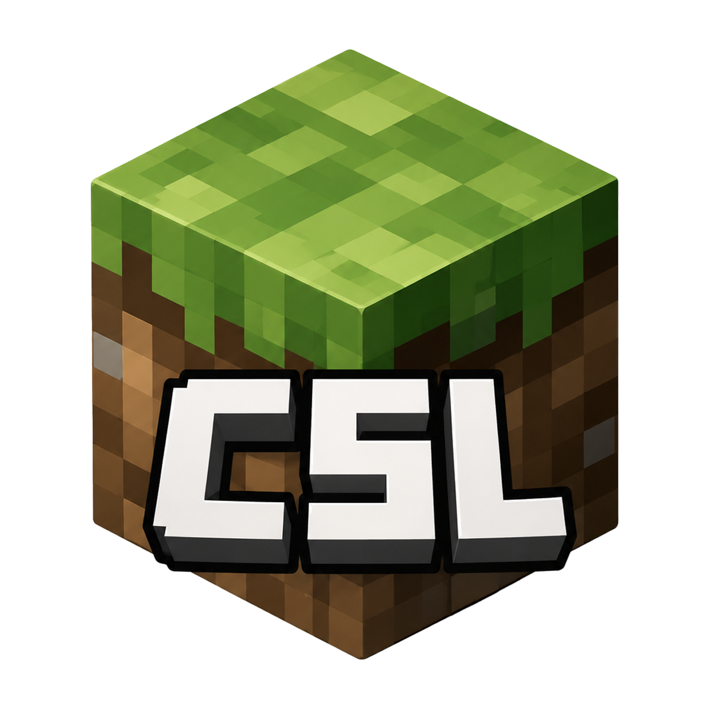

<p align="center">
  
</p>

<h1 align="center">CSL · Craft Something Launcher</h1>

<p align="center">
  <b>开源、跨平台的 Minecraft Java 版启动器</b>
</p>

<p align="center">
  
  
  
  
</p>

---

## 简介

**CSL（Craft Something Launcher）** 是一个开源、跨平台的 Minecraft Java 版启动器，支持
Mod 管理、游戏定制、ModLoader 安装（Forge、NeoForge、Cleanroom、Fabric、Legacy Fabric、
Quilt、LiteLoader、OptiFine）、整合包创建、UI 自定义等多种功能。

CSL 拥有出色的跨平台能力：不仅支持 Windows、Linux、macOS、FreeBSD 等操作系统，
还支持 x86、ARM、RISC-V、MIPS、LoongArch 等多种 CPU 架构，让玩家在不同平台上都能轻松享受 Minecraft。

> **说明**：CSL 源自开源项目 Hello Minecraft! Launcher（HMCL），并在其基础上持续演进。
> 上游版权声明保留在所有源码文件头中，详见[许可证](#许可证)一节。

## 功能特性

- 🧩 **Mod 管理** — 一键安装、更新、禁用/启用 Mod，支持 Fabric、Quilt、Forge、NeoForge 等主流加载器生态
- ⚙️ **ModLoader 安装** — Forge / NeoForge / Cleanroom / Fabric / Legacy Fabric / Quilt / LiteLoader / OptiFine
- 📦 **整合包** — 创建与导入整合包，支持 Terracotta 等格式，方便分享与备份
- 🎨 **UI 自定义** — 内置主题（`csl.default`、`csl.classic`），支持自定义主题包与动态换肤
- 🌍 **多语言** — 内置中文、英文、日文、西班牙语、俄语、乌克兰语、阿拉伯语、文言文等语言
- 🔐 **账号系统** — Microsoft 账号认证，支持自定义 authlib-injector 认证服务器
- 🗂️ **版本管理** — 从官方源下载并管理任意游戏版本，支持版本隔离
- 🖥️ **Java 管理** — 自动检测并管理多个 Java 运行时，支持下载所需 JDK
- 🚀 **一键启动** — 启动前自动校验游戏完整性，支持 LWJGL 运行时注入

## 技术栈

| 类别 | 技术 |
|------|------|
| 语言 | Java 17+（推荐 21） |
| GUI | JavaFX + JFoenix + MonetFX（Material You 动态取色） |
| 构建 | Gradle（Kotlin DSL）+ Shadow 插件 |
| 依赖解析 | Mojang 官方元数据 / BMCLAPI 镜像 / foojay Disco API |
| 代码质量 | Checkstyle + JetBrains Annotations（严格空安全规范） |

## 模块结构

```
minecraft-launcher/
├── CSL/          # 主程序：UI、游戏启动、版本管理、认证、主题
├── CSLCore/      # 核心库：压缩、NBT、网络、JSON、跨平台工具（被各模块共享）
├── CSLBoot/      # 启动引导器：负责拉起主程序（兼容 Java 8 运行）
├── buildSrc/     # 构建插件：打包（deb）、CI（Jenkins/GitHub Actions）、本地化检查等
├── minecraft/
│   └── libraries/
│       ├── CSLMultiMCBootstrap/          # 游戏侧 MultiMC 引导支持
│       └── CSLTransformerDiscoveryService/ # 游戏侧 Transformer 发现服务
├── config/       # 项目配置（project.properties、checkstyle 规则）
├── docs/         # 多语言文档（README、贡献指南、发布计划、平台支持表）
└── gradle/       # Gradle 版本目录（libs.versions.toml）
```

## 构建

### 环境要求

- **JDK 17 或更高版本**（推荐 JDK 21/25 LTS），并确保 `JAVA_HOME` 指向正确目录

### 从源码构建

```shell
git clone https://github.com/MrWoods1692/CSL.git
cd CSL/minecraft-launcher
./gradlew clean makeExecutables
```

构建产物位于 `CSL/build/libs/` 目录。

### 本地开发运行

```shell
./gradlew :CSL:run
```

### 测试

```shell
./gradlew test
```

## 下载

- [GitHub Releases](https://github.com/MrWoods1692/CSL/releases)

## 文档

| 文档 | 说明 |
|------|------|
| [贡献指南](./minecraft-launcher/docs/Contributing.md) | 如何构建、调试与贡献代码 |
| [平台支持](./minecraft-launcher/docs/PLATFORM.md) | 支持的 OS / CPU 架构一览 |
| [本地化](./minecraft-launcher/docs/Localization.md) | 翻译与多语言贡献指南 |
| [发布计划](./minecraft-launcher/docs/ReleaseSchedule.md) | 版本发布节奏 |

## 贡献

CSL 是一个社区驱动的开源项目，欢迎任何形式的贡献：

1. 在 [GitHub Issues](https://github.com/MrWoods1692/CSL/issues) 报告 Bug 或提出新功能建议
2. Fork 本仓库并提交 [Pull Request](https://github.com/MrWoods1692/CSL/compare)
3. 参与[本地化翻译](./minecraft-launcher/docs/Localization.md)与文档完善

贡献前请阅读[贡献指南](./minecraft-launcher/docs/Contributing.md)。

## 许可证

本项目基于 **GPLv3** 协议分发，并附加以下条款（GPLv3 第 7 节）：

1. 分发修改版本时，必须以合理方式修改软件名称或版本号，以区别于原始版本。
2. 不得移除软件中展示的版权声明。

源码文件头保留上游项目（Hello Minecraft! Launcher，作者 huangyuhui）的版权声明。
完整的 GPLv3 许可文本请参见 [GNU GPLv3](https://www.gnu.org/licenses/gpl-3.0.html)。
