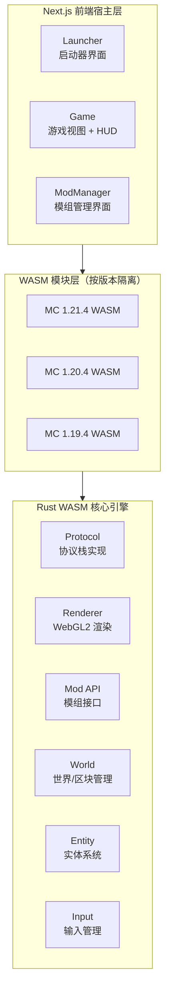

# CSL Web Runner — Minecraft 浏览器端运行时

> 基于 **Rust + WebAssembly + WebGL2** 构建的 Minecraft 兼容性 Web 运行时（Web Runtime），采用 **Next.js** 作为前端宿主框架，以**纯静态导出**（Static Export）方式部署，无需任何服务端运行时支撑。

## 概述

CSL Web Runner 是 CSL 启动器生态的浏览器端实现方案。其核心目标是将 Minecraft Java Edition 的游戏逻辑移植至 Web 平台，同时保持与原版服务端协议的二进制兼容性。整体架构遵循"引擎与协议分离、版本按需编译、前端零耦合"的设计原则，通过 WebAssembly 模块化加载机制实现多版本并行支持。

### 关键术语

| 术语 | 释义 |
|------|------|
| **WebAssembly (WASM)** | 一种低级二进制指令格式，可作为 JavaScript 的高性能补充。本项目将 Rust 编译为 WASM，在浏览器中以接近原生的性能执行游戏核心逻辑。 |
| **WebGL2** | 基于 OpenGL ES 3.0 的 Web 图形 API。本项目通过 WASM 调用 WebGL2 接口实现体素渲染管线。 |
| **体素渲染（Voxel Rendering）** | 以三维体素（Voxel，体积像素）为基本单元的渲染技术，是 Minecraft 类游戏的核心渲染范式。 |
| **静态导出（Static Export）** | Next.js 的 `output: 'export'` 模式，将应用预渲染为纯静态 HTML/CSS/JS，可托管于任意 CDN 或静态服务器。 |
| **协议兼容（Protocol Compatibility）** | 指客户端与服务端遵循相同的网络协议规范，可实现跨实现互通。本项目实现 Minecraft Java Edition 的协议层。 |

## 核心特性

- 🎮 **多版本并行支持** — 采用按版本独立编译策略，每个 Minecraft 版本对应一个独立 WASM 模块，运行时按需加载。当前支持 1.21.4 / 1.20.4 / 1.19.4，并规划向下兼容至 1.8.9。
- 🌐 **原版服务端互联** — 实现 Minecraft Java Edition 网络协议栈，通过 WebSocket 代理桥接 TCP 协议，支持连接原版多人服务器。
- 🏠 **程序化地形生成** — 采用程序化生成（Procedural Generation）算法实时构建无限世界，无需服务端参与即可实现单人游戏体验。
- 🧩 **可扩展模组系统** — 提供基于 Rust trait 的模组 API，支持以 WASM 模块形式动态加载第三方扩展。
- 🔌 **版本隔离的 WASM 模块化** — 各版本编译为独立 WASM 模块，避免版本间符号冲突，同时实现按需加载以优化首屏体积。
- 🎨 **WebGL2 渲染管线** — 自研体素渲染引擎，集成纹理图集（Texture Atlas）、动态光照（Dynamic Lighting）、距离雾效（Distance Fog）等特性。
- 📦 **零后端部署** — 构建产物为纯静态资源，可部署至 GitHub Pages、Vercel、Netlify、Cloudflare Pages 等任意静态托管平台。

## 技术架构



### 架构分层说明

1. **前端宿主层**：基于 Next.js 14 App Router 构建，负责 UI 呈现、用户交互与 WASM 模块的生命周期管理。该层与游戏逻辑完全解耦，仅通过 WASM 导出的接口进行通信。
2. **WASM 模块层**：每个 Minecraft 版本编译为独立的 WASM 模块，通过 `wasm-bindgen` 生成 JavaScript 绑定。运行时按用户选择的版本动态加载对应模块，实现版本隔离。
3. **核心引擎层**：以 Rust 实现的游戏核心，包括协议栈、渲染器、世界管理、实体系统、模组 API 与输入处理。该层编译为 WASM 后在前端宿主中执行。

## 项目结构

```
csl-webversion/
├── wasm-core/              # Rust WASM 核心库（版本无关的公共引擎）
│   ├── Cargo.toml
│   └── src/
│       ├── lib.rs          # 引擎入口与 WASM 导出绑定
│       ├── protocol.rs     # Minecraft 协议栈实现
│       ├── renderer.rs     # WebGL2 渲染引擎
│       ├── world.rs        # 世界与区块管理
│       ├── entity.rs       # 实体系统（玩家、生物）
│       ├── mod_api.rs      # 模组 API 接口定义
│       ├── input.rs        # 输入事件管理
│       └── utils.rs        # 通用工具函数
├── wasm-versions/          # 各版本 WASM 模块（版本特定的协议适配）
│   ├── mc1_21_4/           # Minecraft 1.21.4
│   ├── mc1_20_4/           # Minecraft 1.20.4
│   └── mc1_19_4/           # Minecraft 1.19.4
├── mods/                   # 内置模组
│   ├── minimap/            # 小地图覆盖层
│   ├── jeito/              # 物品与合成配方查看器
│   └── optifine/           # 图形性能优化
├── csl-web-runner/         # Next.js 前端宿主
│   ├── src/
│   │   ├── app/            # App Router 路由与页面
│   │   └── components/
│   │       ├── Launcher/   # 启动器界面组件
│   │       ├── Game/       # 游戏视图与 HUD 组件
│   │       └── Mods/       # 模组管理界面组件
│   └── public/wasm/        # WASM 模块输出目录
└── build.sh                # 一键构建脚本
```

## 快速开始

### 前置依赖

| 依赖 | 用途 | 安装方式 |
|------|------|----------|
| **Rust** | 编译 WASM 核心引擎 | [rustup.rs](https://rustup.rs/) |
| **wasm-pack** | Rust → WASM 构建工具链 | `cargo install wasm-pack` |
| **wasm-bindgen-cli** | 生成 JS/WASM 互操作绑定 | `cargo install wasm-bindgen-cli` |
| **Node.js** 18+ | 前端构建与依赖管理 | [nodejs.org](https://nodejs.org/) |

### 一键构建

```bash
cd csl-webversion
./build.sh
```

构建脚本将依次完成：编译各版本 WASM 模块 → 安装前端依赖 → 执行静态导出。产物输出至 `csl-web-runner/out/`。

### 手动构建

```bash
# 1. 构建各版本 WASM 模块（以 --target web 生成浏览器可直接加载的 ES 模块）
cd wasm-versions/mc1_21_4
wasm-pack build --release --target web --out-dir ../../csl-web-runner/public/wasm/mc1_21_4

cd ../mc1_20_4
wasm-pack build --release --target web --out-dir ../../csl-web-runner/public/wasm/mc1_20_4

cd ../mc1_19_4
wasm-pack build --release --target web --out-dir ../../csl-web-runner/public/wasm/mc1_19_4

# 2. 构建前端（执行 Next.js 静态导出）
cd ../../csl-web-runner
npm install
npm run build

# 3. 静态产物位于 out/ 目录
```

### 本地预览

```bash
cd csl-web-runner
npx serve out
# 访问 http://localhost:3000
```

## 支持的 Minecraft 版本

| 版本 | 协议号 | 状态 | 说明 |
|------|--------|------|------|
| 1.21.4 | 769 | ✅ 已实现 | 最新版本 |
| 1.20.4 | 765 | ✅ 已实现 | 樱花树林更新 |
| 1.19.4 | 762 | ✅ 已实现 | 深暗之域更新 |
| 1.18.2 | 758 | 🔄 规划中 | 洞穴与山崖 |
| 1.17.1 | 756 | 🔄 规划中 | 洞穴更新 |
| 1.16.5 | 754 | 🔄 规划中 | 下界更新 |
| 1.12.2 | 340 | 🔄 规划中 | 经典模组生态版本 |
| 1.8.9  | 47  | 🔄 规划中 | 经典 PvP 版本 |

> **协议号（Protocol Version）**：Minecraft 客户端与服务端通过协议号标识兼容性。不同版本的游戏协议存在差异，本项目为每个版本独立实现协议适配层。

## 模组系统

### 内置模组

| 模组 | 功能描述 |
|------|----------|
| **CSL 小地图** | 在游戏视口叠加显示周边地形的小地图覆盖层 |
| **CSL 物品查看器** | 提供全物品清单与合成配方查询功能 |
| **CSL 性能优化** | 提供图形设置调节与渲染性能优化选项 |

### 模组 API

模组通过实现 Rust trait 扩展游戏功能。trait 是 Rust 的接口抽象机制，模组通过实现特定方法挂载到游戏生命周期的不同阶段：

```rust
pub trait Mod: Send + Sync {
    /// 返回模组元信息（名称、版本、作者等）
    fn info(&self) -> &ModInfo;
    
    /// 模组加载时回调（初始化阶段）
    fn on_load(&mut self) {}
    
    /// 每游戏刻（Tick）回调，用于更新世界与玩家状态
    fn on_tick(&mut self, world: &mut World, player: &mut Player) {}
    
    /// 渲染后处理回调，用于叠加自定义渲染
    fn on_render_post(&mut self, renderer: &mut Renderer) {}
    
    /// 按键事件回调，返回 true 表示事件已被消费
    fn on_key(&mut self, key: &str, pressed: bool) -> bool { false }
}
```

> **`Send + Sync` 约束**：Rust 的线程安全标记 trait。`Send` 表示类型可在线程间转移所有权，`Sync` 表示类型可被多线程共享引用。此处约束确保模组可在 WASM 的异步执行环境中安全调用。

## 部署

`out/` 目录为纯静态资源（HTML/CSS/JS/WASM），可部署至任意静态托管服务：

| 平台 | 部署方式 |
|------|----------|
| **GitHub Pages** | 推送 `out/` 至 `gh-pages` 分支 |
| **Vercel** | 导入项目，框架预设选择 Next.js（静态导出模式） |
| **Netlify** | 拖拽 `out/` 文件夹至部署界面 |
| **Cloudflare Pages** | 设置构建输出目录为 `out` |
| **自建服务器** | Nginx、Apache 等任意静态文件服务器 |

> **MIME 类型配置**：部署时需确保服务器为 `.wasm` 文件返回 `application/wasm` MIME 类型，否则浏览器将拒绝加载 WASM 模块。

## 操作说明

| 按键 | 功能 |
|------|------|
| W / A / S / D | 前后左右移动 |
| 鼠标 | 视角控制（Pointer Lock 模式） |
| 空格 | 跳跃 |
| Shift | 潜行 |
| Ctrl | 冲刺 |
| ESC | 退出指针锁定 |
| E | 打开物品栏（规划中） |

> **指针锁定（Pointer Lock）**：浏览器 API，可将鼠标指针锁定在游戏视口内并隐藏光标，实现第一人称视角的无限旋转。

## 技术栈

| 层级 | 技术选型 | 选型理由 |
|------|----------|----------|
| 核心引擎 | Rust → WASM | 提供接近原生的执行性能与内存安全保证 |
| 渲染层 | WebGL2（GLSL ES 3.0） | 浏览器原生支持，无需插件，兼容性广 |
| 网络协议 | Minecraft Java Edition Protocol | 实现与原版服务端的二进制协议兼容 |
| 前端宿主 | Next.js 14 + React 18 + TypeScript | 提供组件化开发模型与静态导出能力 |
| 部署模式 | 纯静态导出（`output: 'export'`） | 零后端依赖，降低部署与运维成本 |

## 路线图

### 已完成

- [x] 多版本 WASM 模块化架构
- [x] WebGL2 体素渲染引擎
- [x] 程序化地形生成
- [x] 模组 API 系统
- [x] 启动器 UI

### 进行中 / 规划中

- [ ] 完整协议实现（登录、区块加载、实体同步）
- [ ] 音效系统
- [ ] 物品栏系统
- [ ] 合成系统
- [ ] 多人游戏功能完善
- [ ] 更多 Minecraft 版本支持
- [ ] 模组市场

## 许可证

本项目遵循与主项目相同的许可证协议，详见根目录 [LICENSE](../LICENSE) 文件。
