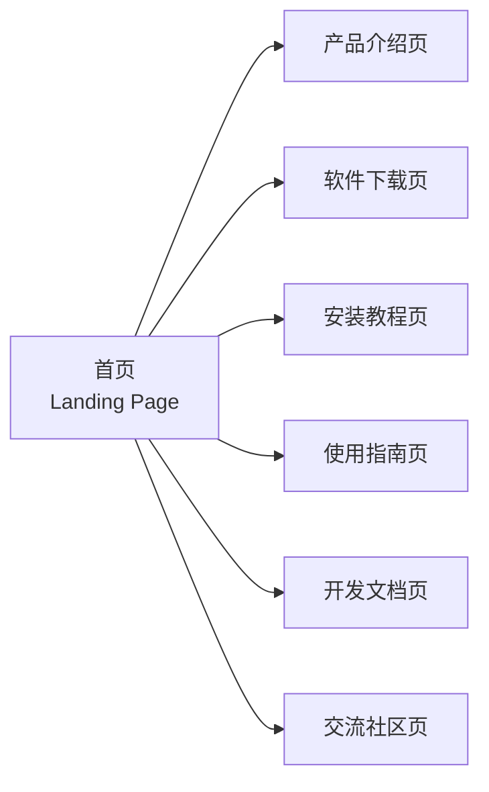

# 产品需求文档（PRD）

> **文档版本**：v1.0  
> **产品名称**：CSL 启动器官方网站  
> **文档状态**：已定稿

---

## 1. 产品概述

### 1.1 产品定位

CSL 启动器官方网站是 CSL 桌面端启动器的官方门户站点，承担产品展示、分发引导、用户教育与社区运营四大职能。站点采用纯前端架构（SPA + 静态托管），不依赖任何服务端运行时。

### 1.2 产品描述

面向《Minecraft》玩家群体的 CSL 启动器官方门户，提供产品介绍、多平台分发、安装与使用教程、开发文档、开源仓库入口及社区引流。支持深色/浅色主题切换，遵循响应式 Web 设计（Responsive Web Design）原则，确保桌面端与移动端的一致体验。

> **响应式 Web 设计（Responsive Web Design, RWD）**：一种使网页在不同设备与屏幕尺寸下自适应呈现的设计方法，通过弹性布局（Flexbox/Grid）、媒体查询（Media Queries）与相对单位实现。

## 2. 用户画像与使用场景

### 2.1 目标用户画像

| 用户角色 | 典型特征 | 核心诉求 |
|----------|----------|----------|
| Minecraft 玩家 | 游戏经验丰富，关注启动器功能与兼容性 | 获取稳定、易用的启动器 |
| 启动器使用者 | 需要安装与配置启动器 | 下载适配操作系统的版本，查阅安装教程 |
| 开发者 / 技术爱好者 | 具备技术背景，关注开源项目 | 查阅开发文档、获取源代码、参与贡献 |
| 社区参与者 | 活跃于即时通讯平台 | 加入社区获取支持与交流 |

### 2.2 核心使用场景

1. **产品认知**：用户访问首页，了解 CSL 启动器的功能特性与核心价值主张
2. **版本获取**：用户在下载页选择适配操作系统的版本并完成下载
3. **安装引导**：用户参照安装教程完成启动器部署
4. **使用学习**：用户查阅使用指南与 FAQ 解决使用问题
5. **开发参与**：开发者查阅开发文档与开源仓库，参与社区贡献
6. **社区引流**：用户通过社区入口加入即时通讯群组获取支持
7. **源码导出**：用户一键导出网站完整源代码用于学习或二次开发

## 3. 信息架构与功能规格

### 3.1 站点信息架构

> **信息架构（Information Architecture, IA）**：对站点内容进行组织、分类与导航结构设计的学科，目标是提升信息可发现性与用户寻路效率。本站采用扁平化一级导航，降低用户认知负荷。

### 3.2 页面功能规格

#### 3.2.1 首页（Landing Page）

**功能目标**：建立产品第一印象，引导用户进入核心转化路径。

| 功能项 | 描述 |
|--------|------|
| 品牌展示 | 呈现 CSL 启动器品牌标识与核心价值主张（Value Proposition） |
| 全局导航 | 提供产品介绍、软件下载、安装教程、使用指南、开发文档、交流社区六个一级导航入口 |
| 主题切换 | 提供深色/浅色模式切换按钮，状态持久化至 localStorage |
| 快速入口 | 提供「下载」与「开始使用」两个主转化按钮（CTA, Call To Action） |
| 入场动画 | 页面加载时，品牌标识与核心内容区域执行入场动画 |
| 交互反馈 | 导航项与 CTA 按钮具备 hover 交互动效 |

> **价值主张（Value Proposition）**：产品向用户承诺的核心利益，通常以简短文案呈现，回答"用户为何选择此产品"。
>
> **CTA（Call To Action）**：引导用户执行特定操作的交互元素，是转化漏斗的关键节点。

#### 3.2.2 产品介绍页

**功能目标**：传达产品功能特性与差异化优势。

| 功能项 | 描述 |
|--------|------|
| 功能特性列表 | 以卡片形式展示 CSL 启动器的核心功能特性 |
| 优势亮点 | 阐述产品相对于竞品的差异化优势 |
| 媒体展示 | 展示产品截图或演示视频（如有） |
| 滚动动画 | 功能特性卡片在进入视口时依次执行入场动画（stagger animation） |
| 交互反馈 | 功能特性卡片具备 hover 交互动效 |

> **Stagger Animation（错峰动画）**：多个元素以微小时间差依次执行相同动画，形成序列感与节奏感，避免一次性全部出现造成的视觉冲击。

#### 3.2.3 软件下载页

**功能目标**：提供多平台分发入口与版本管理信息。

| 功能项 | 描述 |
|--------|------|
| 多平台分发 | 提供 Windows、macOS、Linux 等多平台下载入口 |
| 版本信息 | 展示当前最新版本号与发布日期 |
| 版本历史 | 提供历史版本记录，含版本号、发布日期、更新说明（Changelog）、下载链接 |
| 下载入口 | 每个版本提供独立下载按钮 |
| 源码导出 | 提供「一键导出全部代码」按钮，将网站完整源代码（含 `src/` 下页面、组件、样式、配置）打包为 `.zip` 文件下载 |
| 导出按钮样式 | 与「潮流个性」主题保持一致（高对比色、实心阴影、粗描边），支持深色/浅色模式 |
| 滚动动画 | 版本卡片在进入视口时依次执行入场动画 |
| 交互反馈 | 下载按钮与导出按钮具备 hover 交互动效 |

> **Changelog（更新日志）**：记录软件各版本变更内容的文档，通常包含新功能、改进与缺陷修复说明，是用户评估升级必要性的依据。

#### 3.2.4 安装教程页

**功能目标**：降低用户安装门槛，提供分平台图文指引。

| 功能项 | 描述 |
|--------|------|
| 分平台教程 | 按操作系统（Windows、macOS、Linux）分类展示安装步骤 |
| 图文说明 | 每个步骤包含图文说明，降低理解成本 |
| 常见问题 | 提供安装常见问题解答（Troubleshooting） |
| 滚动动画 | 安装步骤卡片在进入视口时依次执行入场动画 |
| 强调动画 | 步骤标题与关键符号执行强调动画 |

> **Troubleshooting（故障排查）**：针对用户在使用过程中可能遇到的常见问题，提供原因分析与解决方案的文档模块。

#### 3.2.5 使用指南页

**功能目标**：提供产品使用教学与自助支持。

| 功能项 | 描述 |
|--------|------|
| 快速上手 | 提供快速上手教程，说明基本操作流程 |
| FAQ | 提供常见问题解答（Frequently Asked Questions） |
| 使用技巧 | 提供使用技巧与注意事项 |
| 滚动动画 | 教程内容区域在进入视口时依次执行入场动画 |
| 交互反馈 | FAQ 条目具备 hover 交互动效 |

> **FAQ（Frequently Asked Questions）**：高频问题集合，以问答形式呈现，是用户自助支持（Self-Service Support）的核心载体，可有效降低客服成本。

#### 3.2.6 开发文档页

**功能目标**：为开发者提供技术文档与贡献指引。

| 功能项 | 描述 |
|--------|------|
| 文档目录 | 展示开发文档目录结构 |
| 文档内容 | 提供 API 文档、技术规范、贡献指南等内容 |
| 文档搜索 | 提供文档全文搜索功能 |
| 滚动动画 | 文档目录与内容区域在进入视口时执行入场动画 |
| 交互反馈 | 目录项具备 hover 交互动效 |

#### 3.2.7 交流社区页

**功能目标**：引导用户加入社区，构建用户生态。

| 功能项 | 描述 |
|--------|------|
| 社区入口 | 提供四个社区平台的加入方式：Telegram（群组链接/二维码）、Discord（服务器邀请链接）、QQ（群号/二维码）、微信（群二维码/添加方式） |
| 仓库链接 | 提供开源仓库链接（GitHub 等） |
| 平台说明 | 说明各平台的用途定位与活跃度 |
| 滚动动画 | 社区平台卡片在进入视口时依次执行入场动画 |
| 交互反馈 | 社区平台卡片与链接具备 hover 交互动效 |

### 3.3 全站动效规格

#### 3.3.1 页面加载动画（Page Load Animation）

- 页面首次加载时，核心内容区域执行 fade-in（淡入）入场动画
- 品牌标识与标题执行 scale（缩放）入场动画

> **入场动画（Entrance Animation）**：元素首次出现时执行的过渡动画，用于引导用户注意力，提升页面"活力感"。

#### 3.3.2 滚动触发动画（Scroll-Triggered Animation）

- 用户滚动页面时，进入视口（Viewport）的元素执行入场动画
- 入场动画类型包括：fade（淡入）、slide（滑入）、scale（缩放）
- 卡片类元素依次执行入场动画，形成序列感（stagger effect）

> **视口（Viewport）**：浏览器中实际可见的页面区域。滚动触发动画通过 Intersection Observer API 检测元素是否进入视口。

#### 3.3.3 交互动效（Interaction Micro-Interactions）

- 按钮 hover 时执行 scale 与阴影变化动效
- 卡片 hover 时执行轻微上浮与阴影增强动效
- 导航菜单项 hover 时执行下划线滑入动效

> **微交互（Micro-Interaction）**：用户与界面元素交互时产生的细粒度反馈动效，用于增强操作确认感与产品精致度。

#### 3.3.4 页面切换动画（Route Transition）

- 用户点击导航菜单切换页面时，执行 fade 过渡动画

> **路由过渡（Route Transition）**：单页应用（SPA）中页面切换时的过渡动画，用于掩盖内容替换的突兀感，提升流畅度。

#### 3.3.5 强调动画（Emphasis Animation）

- 页面标题与关键符号执行强调动画（如轻微抖动、闪烁、颜色变化）
- 强调动画仅在页面加载或首次进入视口时执行一次

#### 3.3.6 动画风格约束

- 动画风格与「潮流个性」主题保持一致，体现高对比、硬朗边缘、玩味失序的视觉感受
- 动画时长控制在 0.2s 至 0.6s 之间，避免过长影响体验
- 动画缓动函数使用 `ease-out` 或 `ease-in-out`，确保流畅自然
- 使用 motion（Framer Motion）库实现全部动画效果

> **缓动函数（Easing Function）**：控制动画进度随时间变化的曲线。`ease-out` 起始快、结束慢，适合入场动画；`ease-in-out` 两端慢、中间快，适合对称过渡。

## 4. 业务规则与逻辑

### 4.1 主题切换规则

- 用户点击主题切换按钮，站点在深色模式（Dark Mode）与浅色模式（Light Mode）之间切换
- 主题偏好持久化至 `localStorage`，用户再次访问时自动应用上次选择的主题

> **深色模式（Dark Mode）**：以深色背景为主的界面主题，可降低屏幕亮度、减少视觉疲劳，在低光环境下提升阅读舒适度。

### 4.2 下载规则

- 用户点击下载按钮，触发对应版本的文件下载
- 下载前无需用户注册或登录（零门槛分发）

### 4.3 导航规则

- 全局导航在所有页面保持可见（Persistent Navigation）
- 用户点击导航菜单项，跳转至对应页面
- 移动端导航收起为汉堡菜单（Hamburger Menu），点击展开

> **持久导航（Persistent Navigation）**：在所有页面保持一致的导航结构，确保用户随时可访问站点各模块，降低迷失感。

### 4.4 响应式适配规则

- **桌面端**：导航横向排列，内容区域宽度适中
- **移动端**：导航收起为汉堡菜单，内容区域自适应屏幕宽度，图片与文字自动缩放

### 4.5 代码导出规则

- 用户点击「一键导出全部代码」按钮，触发网站完整源代码打包
- 打包内容包含 `src/` 目录下的所有页面、组件、样式、配置等文件
- 打包格式为 `.zip` 文件
- 文件命名规则：`CSL-Website-Source-YYYYMMDD.zip`（`YYYYMMDD` 为导出日期）
- 导出过程中显示加载提示，完成后自动下载到本地

### 4.6 动画执行规则

- 页面加载动画在页面首次加载时自动执行
- 滚动触发动画在元素进入视口时自动执行，每个元素仅执行一次
- 交互动效在用户 hover 或点击时触发
- 页面切换动画在路由切换时自动执行
- 强调动画在页面加载或元素首次进入视口时执行一次
- 动画执行过程中，用户可正常操作页面，动画不阻塞交互（Non-Blocking）

### 4.7 动画性能与可访问性规则

- 动画帧率保持在 60fps，确保流畅体验
- 用户设备性能较低时，自动降低动画复杂度或禁用部分动画（降级策略，Graceful Degradation）
- 用户系统设置为「减少动画」（`prefers-reduced-motion`）时，禁用全部装饰性动画，仅保留必要的过渡效果
- 动画不影响屏幕阅读器等辅助技术的正常使用

> **`prefers-reduced-motion`**：CSS 媒体查询，用于检测用户是否在系统设置中启用了"减少动画"偏好。开发者应据此禁用非必要动画，以照顾前庭功能障碍等对运动敏感的用户。
>
> **优雅降级（Graceful Degradation）**：在资源受限或功能不支持的场景下，逐步降低功能复杂度而非完全失效的设计策略，确保核心功能始终可用。

## 5. 异常与边界情况

| 场景 | 处理方式 |
|------|----------|
| 下载链接失效 | 页面提示「下载链接暂时不可用，请稍后重试」 |
| 图片加载失败 | 显示占位图（Placeholder）或文字说明 |
| 社区链接失效 | 页面提示「链接暂时不可用」 |
| 网络异常 | 页面提示「网络连接失败，请检查网络设置」 |
| 浏览器不支持主题切换 | 默认使用浅色主题（Fallback） |
| 代码导出失败 | 页面提示「代码导出失败，请稍后重试」 |
| 代码打包超时 | 页面提示「打包时间较长，请耐心等待」 |
| 浏览器不支持动画 | 禁用全部动画，页面正常显示静态内容 |
| 动画执行卡顿 | 自动降低动画复杂度或禁用部分动画 |
| 用户系统设置为减少动画 | 禁用全部装饰性动画，仅保留必要过渡效果 |

> **占位图（Placeholder）**：图片加载失败时显示的替代内容，避免出现破损图标，维持页面视觉完整性。
>
> **兜底策略（Fallback）**：当首选方案不可用时启用的备选方案，确保功能不因环境限制而完全失效。

## 6. 验收标准

| 编号 | 验收场景 | 预期结果 |
|------|----------|----------|
| AC-1 | 用户访问首页，查看 CSL 启动器核心价值与导航菜单 | 页面加载动画与 hover 交互动效正常执行 |
| AC-2 | 用户点击「软件下载」，选择对应操作系统版本并下载 | 页面切换动画与滚动触发动画正常，下载成功 |
| AC-3 | 用户点击「安装教程」，查看对应系统图文安装步骤 | 步骤卡片入场动画与标题强调动画正常 |
| AC-4 | 用户点击「使用指南」，阅读快速上手教程与 FAQ | 内容区域入场动画与 FAQ 条目 hover 动效正常 |
| AC-5 | 用户点击「交流社区」，查看四个社区平台并访问其中一个链接 | 社区卡片入场动画与 hover 动效正常，链接可访问 |
| AC-6 | 用户点击主题切换按钮 | 深色/浅色模式切换成功，动画效果在两种主题下均正常显示 |
| AC-7 | 用户在软件下载页点击「一键导出全部代码」按钮 | 成功下载包含完整源代码的 `.zip` 文件 |
| AC-8 | 用户在移动端访问网站 | 导航菜单、内容区域、图片均正常显示且操作流畅，动画效果在移动端正常执行且不影响性能 |

> **验收标准（Acceptance Criteria, AC）**：定义产品功能"完成"的可验证条件，是开发完成与质量验收的判定依据。每条 AC 应具备可测试性（Testable）。

## 7. 本期不实现功能（Out of Scope）

以下功能不在本期版本范围内，留待后续迭代评估：

- 用户注册与登录系统（身份认证体系）
- 用户评论与反馈功能（UGC 内容）
- 在线客服或聊天功能（实时通讯）
- 数据统计与分析功能（埋点与数据看板）

> **Out of Scope（范围外）**：产品需求文档中明确排除的功能项，用于控制项目范围（Scope Management），避免范围蔓延（Scope Creep）。
- 多语言版本切换
- 内容管理后台
- 搜索引擎优化（SEO）相关配置
- 网站访问统计与埋点
- 邮件订阅功能
- 版本自动更新提醒